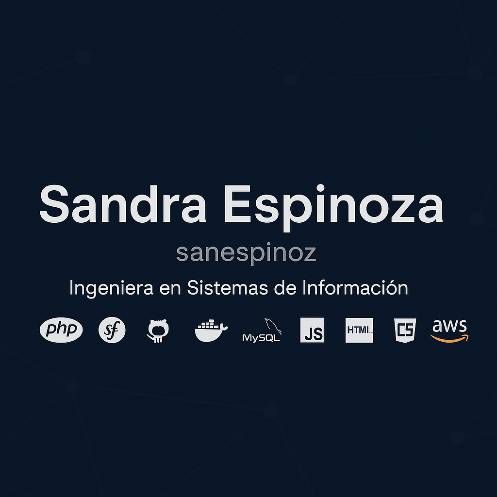

  

# 👋 Hola, mi nombre es Sandra

🎓 **Ingeniera en Sistemas de Información**  
💻 **Desarrolladora de aplicaciones web | Backend & Frontend**  
🗓️ Más de 10 años de experiencia en desarrollo de software

---

### 🚀 Tecnologías y herramientas que uso:

- **Lenguajes & Frameworks:**  
  PHP, Symfony, Laravel, JavaScript, TypeScript, HTML, CSS, Python, Node.js, Tailwind, Rasa, Odoo

- **Bases de datos:**  
  MySQL, PostgreSQL, MongoDB

- **APIs:**  
  Consumo y desarrollo de APIs RESTful  
  Experiencia con API Platform  
  Autenticación, pruebas funcionales y de integración

- **Herramientas y prácticas:**  
  GitHub / Bitbucket  
  CI/CD con GitHub Actions (prácticas realizadas)  
  Test-Driven Development (TDD)  
  Automatización de procesos con UiPath  
  Postman para pruebas de API  
  Docker  
  Noción de Linux  
  LocalStack, AWS S3, Bunny  
  Familiaridad con Redis, Kafka, RabbitMQ, Kubernetes (actualmente en proceso de aprendizaje)

- **Metodologías:**  
  Scrum

---

### 🌟 Intereses actuales:

- Retomar y afianzar conocimientos en React
- Profundizar en DevOps (CI/CD, Kubernetes, AWS)
- Practicar más con Redis, Kafka y RabbitMQ
- Automatización avanzada de procesos con UiPath

---

### 📫 Contacto:

- GitHub: [sanespinoz](https://github.com/sanespinoz)
- LinkedIn: [https://www.linkedin.com/in/sandra-espinoza-casas](https://www.linkedin.com/in/sandra-espinoza-casas)
- Email: san.espinoz@gmail.com

---

### 💬 Un poco más:

Soy apasionada por la tecnología y el aprendizaje continuo. Disfruto crear soluciones con impacto real, y me motiva expandirme profesionalmente hacia áreas como la automatización.
